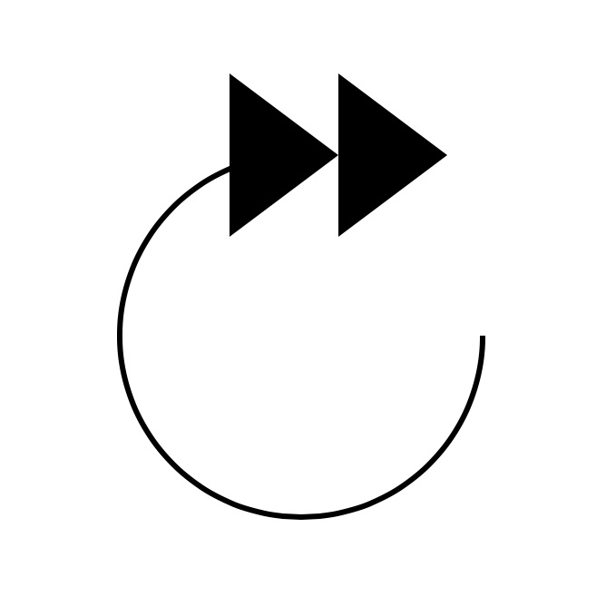

## Anatomy of the Netflix Forward 10s Button
Developing an animated button with Swift UI  

In a previous post, we explored the interaction of the Netflix Play button and how it morphs between play/pause states.  

In this post we will examine what Netflix refers to as the forward 10 seconds button, we will then proceed to develop it with SwiftUI.

## What is a Forward 10 Seconds Button?
The forward 10 seconds button, which we will refer to as the Forward button from now on, allows a user watching video to move the video ahead by 10 seconds (forward seek), if a user repeatedly taps it within a short time since the previous tap, the time duration of the seek will increase.  
The animation sequence for the seek operation is a very long for an interaction on mobile, yet in my opinion it works perfectly. It manages to convey all the necessary information in a really playful way, it also makes the actual seek operation feel shorter, and it suprisingly never gets boring.  
After experiencing Netflix's implementation of the seek button, all other seek buttons on competing apps are just really dull and unrewarding experiences. A true testament to Netflix's UX chops. I hear you say, but content is king! I agree however I would also like to have a joyful experience consuming that content.

## The Choreography of the Button
The Forward button view can be broken down into 4 seperate animatable views.  

* 1. The rounded arrow view.
* 2. The background of the rounded arrow view.
* 3. The duration label, hinting at the time it will seek.
* 4. The accumulation label indicating the actual time that it will seek.

The animation timeline for these views can be seem below.  

### Rounded Arrow View Animation
From the image above, we can see that the rounded arrow view's animation duration is 0.2 seconds. It rotates itself clockwise by a finite amount (We will be using 20 degrees) and then rotates back. The animation is way too short to worry about it's animation curve, hence we will be using the system's default animation curve.  

### Rounded Arrow Background View Animation
The arrow's background animation has the same animation duration as the arrow view, 0.2 seconds. It changes it's opacity from completely transparent to a finite amount of opacity (we will be using 0.3) and then goes back to being completely transparent. We will be using the default animation curve here as well.

### The Duration Label View Animation
The label's animation duration span's the entire duration of the whole composite animation. At the start of the animation it quickly fades out at the initiation of a tap, it does not fade in until all the other animations have completed. We will make our label fade out within 0.1 seconds and start to fade back in at 0.9 seconds. As with the other two animations, we will use the default animation curve.  

### The Accumilation Label View Animation
This label performs the most sophisticated animation of the bunch. At the start it fades in within 0.1 second duration, and at the same time it starts moving out, by translating along the x axis out of the rounded arrow view. The duration of the translation is around 0.5 seconds. Once the label reaches it's final destination it fades out. The duration of the fade out seems to be 0.45 seconds. The translation's animation curve does not match any of the [ease in, ease out, ease in out] animation curves. After much experimentation, this curve seems to be the closest animation curve.

Finally, if the button is tapped while the animation is ongoing, the button will read the current value of the accumilation label and add the value of the duration label then replay the animation accordingly.

## SeekButton.swift
Create a new Xcode project, using the iOS *Single View Application* template. Let's call it *SeekButtonDemo*. In the next screen, make sure to select **SwiftUI** in the drop down menu titled *User Interface*.  

Create a new **User Interface** file, select the **SwiftUI View** option. Call it **SeekButton**.

In **SeekButton.swift** add an `action` property to the `SeekButton` struct, that takes a closure as it's value. This will be the *action* the button performs when tapped.

        var action: (Int) -> Void

`SeekButton_Preview` will throw a "Missing Argument…" error. Fix it by supplying the `action` argument. We will set a simple action that prints *Hello World!*. Finally want to limit the size of the button in our preview, add a `frame` modifier to our `SeekButton`.

    struct SeekButton_Previews: PreviewProvider {
        static var previews: some View {
            SeekButton { interval in
                print("Seek duration \(interval)")
            }
                .frame(width: 200, height: 200)
        }
    }

### RoundArrow
  
At the bottom of the `SeekButton` struct, create an extension to `SeekButton` and create a new `Shape` struct called `RoundArrow`.

    extension SeekButton {
        fileprivate struct RoundArrow: Shape {
            func path(in rect: CGRect) -> Path {
                var path = Path()
                let w = rect.size.width
                let h = rect.size.height
                
                path.addArc(center: CGPoint(x: w * 0.5,
                                            y: h * 0.5),
                            radius: h * 0.5,
                            startAngle: Angle(degrees: 0),
                            endAngle: Angle(degrees: 270),
                            clockwise: false)

                return path
            }
        }
    }

The `RoundArrow` struct is simply a path with an arc thats start from the 0 angle up to 270 degrees angle counter clockwise.  
Back in `SeekButton`'s `body` property, replace the default `Text("Hello, World!")` with the following:

    var body: some View {
        RoundArrow()
            .stroke(lineWidth: 3)
    }

Xcode's Canvas should look like the image above.
> If you don't see the live preview of the button, goto to the *Editor* menu and make sure *Canvas* is selected.  

### RoundArrowHead
  
Inside our `SeekButton` extension, create a new `Shape` struct called `RoundArrowHead`.

        fileprivate struct RoundArrowHead: Shape {
            func path(in rect: CGRect) -> Path {
                var path = Path()
                let w = rect.size.width
                let arrowHead = w * 0.3
                let x = w * 0.6

                for i in 0..<2 {
                    path.move(to: CGPoint(x: x + CGFloat(i) * arrowHead, y: 0.0))
                    path.addLines([
                        CGPoint(x: x - arrowHead + CGFloat(i) * arrowHead, y: -arrowHead * 0.75),
                        CGPoint(x: x - arrowHead + CGFloat(i) * arrowHead, y: arrowHead * 0.75),
                        CGPoint(x: x + CGFloat(i) * arrowHead, y: 0.0)
                    ])
                    path.closeSubpath() 
                }

                return path
            }
        }

`RoundArrowHead` creates two [equilateral triangles](https://en.wikipedia.org/wiki/Equilateral_triangle) that are center aligned to the end of the arrow's arc at the angle 270.0 degrees, pointing to the right. The triangles are infact two subpaths in the same path.
To add the `RoundArrowHead` shape in `SeekButton`'s `body` property, we will need to add it to a `ZStack`. 

    var body: some View {
        ZStack {
            RoundArrow()
                .stroke(lineWidth: 3)
            RoundArrowHead()
                .fill()
        }
    }

This should result in the image above.

### RoundedArrowBackground
Back to our `SeekButton` extension, create a new `Shape` struct called `RoundedArrowBackground`.

    fileprivate struct RoundArrowBackground: Shape {
        func path(in rect: CGRect) -> Path {
            var path = Path()
            let w = rect.size.width
            let h = rect.size.height
            
            path.addArc(center: CGPoint(x: w * 0.5,
                                        y: h * 0.5),
                        radius: h * 0.5,
                        startAngle: Angle(degrees: 0),
                        endAngle: Angle(degrees: 360),
                        clockwise: false)

            return path
        }
    }

`RoundedArrowBackground` simply adds an arc to the path, creating a circle. The width and height will match `RoundArrow`.  
The `body` property of `SeekButton` will become like this.  

        var body: some View {
            ZStack {
                RoundArrowBackground()
                    .fill()
                    .opacity(0.0)
                RoundArrow()
                    .stroke(lineWidth: 3)
                RoundArrowHead()
                    .fill()
            }
        }

The canvas shouldn't change from before, since we have set the `RoundArrowBackground` `opacity()` modifier to 0.

### ScalableText
  

Let's create a new extension to `SeekButton`, in it we will create a new view called `ScalableText`.

    extension SeekButton {
        private struct ScalableText: View {

            var body: some View {
                GeometryReader { geometry in
                    Text("10")
                        .font(
                            .system(size: geometry.size.width * 0.4)
                        )
                        .fontWeight(.regular)
                }
            }
        }
    }

We have wrapped a `Text` view inside a `GeometryReader`. `GeometryReader` has it's own size, which we will use here to to make the `Text`'s font size a mutliple of the width, allowing our `SeekButton` to render it's content at all sizes clearly without having to define the font size for different button sizes.

Now let's add `ScalableText` to the `body` property of `SeekButton`.

    var body: some View {
        ZStack {
            RoundArrowBackground()
                .fill()
                .opacity(0.0)
            RoundArrow()
                .stroke(lineWidth: 3)
            RoundArrowHead()
                .fill()
            ScalableText()
        }
    }

To see `ScalableText` in action, let's update `SeekButton_Previews` buy adding two buttons to preview.

    struct SeekButton_Previews: PreviewProvider {
        static var previews: some View {
            Group {
                SeekButton {
                    print("Hello Button")
                }.frame(width: 200, height: 200)
                
                SeekButton {
                    print("Hello Button")
                }.frame(width: 50, height: 50)
            }.previewLayout(.fixed(width: 300, height: 300))
        }
    }

The above change should update Xcode's canvas as below.  

According to our earlier analysis of the seek button's animation, there is a second label, the accumulation label. We will be using a `ScalableText` view for it as well, however the string and the font weight differ from the the duration label. Let's refactor `ScalableText`.  
Add two variable to `ScalableText`, `fontWeight` and `string`.

    private struct ScalableText: View {
        var string: String
        var fontWeight: Font.Weight = .regular
    
        var body: some View {
            GeometryReader { geometry in
                Text(self.string)
                    .font(
                        .system(size: geometry.size.width * 0.4)
                    )
                    .fontWeight(self.fontWeight)
            }
        }
    }

We update the `body` property of `SeekButton` to pass in the duration, that we will make customizable by allowing the user to provide a seek interval.  

    struct SeekButton: View {
        var interval: Int = 10
        var action: () -> Void
        
        var body: some View {
            ZStack {
                RoundArrowBackground()
                    .fill()
                    .opacity(0.0)
                RoundArrow()
                    .stroke(lineWidth: 3)
                RoundArrowHead()
                    .fill()

                // Duration label
                ScalableText(string: "\(interval)")

                ScalableText(string: "+\(interval)", fontWeight: .bold)
                    .opacity(0.0)
            }
        }
    }

Finally we will add a `ContentShape()` modifier and `TapGesture()` modifier onto the `ZStack` to make our button interactive.  

        .contentShape(Rectangle())
        .onTapGesture {
            self.action(interval)
        }

The `ContentShape()` modifier tells the SwiftUI that the view's hit area, is a rectangle covering the whole view.

With all our views ready, let's animate.

### Animating the Rounded Arrow
From our animation breakdown above, we want the arrow to rotate by 20 degrees, clockwise. The arrow in our view, is composed of 3 shapes, we will rotate all three together by embeding them into a `Group` and adding a `rotationEffect()` modifier.  
Addtionally we want the background to fade in to a maximum opacity of 0.3. We achieve these affects by adding two state properties to our view `rotation` and `backgroundOpacity`.

    @State private var rotation: Angle = .zero
    @State private var backgroundOpacity: Double = 0.0
    
    var body: some View {
        ZStack {
            // Arrow
            Group {
                RoundArrowBackground()
                    .fill()
                    .opacity(backgroundOpacity)
                RoundArrow()
                    .stroke(lineWidth: 3)
                RoundArrowHead()
                    .fill()
            }
            .rotationEffect(rotation)
            
            // Duration label
            ScalableText(string: "\(interval)")
            
            ScalableText(string: "+\(interval)", fontWeight: .bold)
                .opacity(0.0)
        }
        .contentShape(Rectangle())
        .onTapGesture {
            self.animateArrowAndBackground()
            self.action(interval)
        }
    }

The function `animateArrowAndBackground()` looks like this:

    private func animateArrowAndBackground() {
        // Arrow and background animate out
        withAnimation(.easeInOut(duration: 0.1)) {
            rotation = .degrees(20)
            backgroundOpacity = 0.3
        }
        
        // Arrow and background animate in
        withAnimation(Animation.easeInOut(duration: 0.1).delay(0.1)) {
            rotation = .zero
            backgroundOpacity = 0.0
        }
    }

The function has two animation, one to animate out and one to reverse the animation after the other one has completed.

### Animating the Duration Label
To animate the duration label, we will add a new state property `durationLabelOpacity`, add an `opacity()` modifier to the duration label and update our `body` property and tap gesture.   

    @State private var rotation: Angle = .zero
    @State private var backgroundOpacity: Double = 0.0
    @State private var durationLabelOpacity: Double = 1.0
    
    var body: some View {
        ZStack {
            Group {
                RoundArrowBackground()
                    .fill()
                    .opacity(backgroundOpacity)
                RoundArrow()
                    .stroke(lineWidth: 3)
                RoundArrowHead()
                    .fill()
            }
            .rotationEffect(rotation)
            
            // Duration label
            ScalableText(string: "\(interval)")
                .opacity(durationLabelOpacity)
            
            ScalableText(string: "+\(interval)", fontWeight: .bold)
                .opacity(0.0)
        }
        .contentShape(Rectangle())
        .onTapGesture {
            self.animateArrowAndBackground()
            self.animateDurationLabel()
            self.action(interval)
        }
    }

The function `animateDurationLabel()` is very simple.

    private func animateDurationLabel() {
        // Reset the value
        durationLabelOpacity = 1.0

        // Duration label animation
        withAnimation(.easeInOut(duration: 0.1)) {
            durationLabelOpacity = 0.0
        }
    }

Netflix's button flashes the duration label with every tap. We reset the animation value so that we can achieve the flash as well. We will not reverse the animation here, we will tackle that shortly.

### Animating the Accumulation Label
This label is more involved. We will animate the label out by offseting the `TextView` inside `ScalableText`. Let's extend `ScalableText`.

    private struct ScalableText: View {
        var string: String
        var fontWeight: Font.Weight = .regular
        var xOffset: CGFloat = 0
        
        
        var animatableData: CGFloat {
            get { return xOffset }
            set { xOffset = newValue }
        }
        var body: some View {
            GeometryReader { geometry in
                Text(self.string)
                    .font(.system(size: geometry.size.width * 0.4))
                    .fontWeight(self.fontWeight)
                    .offset(x: self.xOffset * geometry.size.width/44.0, y: 0.0)
            }
        }
    }

We've added a new property `xOffset` we will scale the value passed in based on the size of the button, so that the offset animation will always be proportional to the size of the button. We've informed SwiftUI that we want to animate this value by providing it as our `animatableData` property.

> For a great write up on SwiftUI animation, checkout out [this post](https://swiftui-lab.com/swiftui-animations-part1/).

In `SeekButton` we've added two new state variables `accumulationLabelOpacity` and `xOffset`.

    @State private var rotation: Angle = .zero
    @State private var backgroundOpacity: Double = 0.0
    @State private var durationLabelOpacity: Double = 1.0
    @State private var xOffset: CGFloat = 0.0
    @State private var accumulationLabelOpacity: Double = 0.0
    
    var body: some View {
        ZStack {
            Group {
                RoundArrowBackground()
                    .fill()
                    .opacity(backgroundOpacity)
                RoundArrow()
                    .stroke(lineWidth: 3)
                RoundArrowHead()
                    .fill()
            }
            .rotationEffect(rotation)
            
            // Duration label
            ScalableText(string: "\(interval)")
                .opacity(durationLabelOpacity)
            
            ScalableText(string: "+\(interval)", fontWeight: .bold, xOffset: xOffset)
                .opacity(accumulationLabelOpacity)
        }
        .contentShape(Rectangle())
        .onTapGesture {
            self.animateArrowAndBackground()
            self.animateDurationLabel()
            self.animateAccumulationLabel()
            self.action(interval)
        }
    }

The function `animateAccumulationLabel()` looks like this.

    private func animateAccumulationLabel() {
        // Reset the labels animation values
        accumulationLabelOpacity = 0
        xOffset = 0.0
        
        // Fade in
        withAnimation(.easeInOut(duration: 0.1)) {
            accumulationLabelOpacity = 1.0
        }
        
        // Animate out offset
        withAnimation(Animation.timingCurve(0.0, 0.0, 0.2, 1.0, duration: 0.35)) {
            xOffset = 80
        }
        
        // Fade out
        withAnimation(Animation.timingCurve(0.0, 0.0, 0.2, 1.0, duration: 0.45).delay(0.5)) {
            accumulationLabelOpacity = 0.0
        }
    }

Here we reset the animation values, so that when a user taps multiple times, the animation restarts from the beginning. We then fade in the label and offset it's x coordinate by 80.0.
We provide the animation curve here as well, the curve's control points are `(0.0, 0.0)` and `(0.2, 1.0)`.  
> For a better understanding of these timing functions check [Apple's Documentation](https://developer.apple.com/documentation/quartzcore/camediatimingfunction/1522235-init).

After the label has reached it's final destination, we fade it out.

### Accumulating the Label
To increment the value of the accumulation label, we will keep track of the number of ongoing animations by using an animation counter. When the user taps and if an animation is ongoing, we add the interval to the current value of the accumulation label and restart the animation. Once an animation is complete we reduce our counter. When the counter reaches zero, we will fade in the duration label. With that the `SeekButton`'s `body` becomes.

    @State private var rotation: Angle = .zero
    @State private var backgroundOpacity: Double = 0.0
    @State private var durationLabelOpacity: Double = 1.0
    @State private var xOffset: CGFloat = 0.0
    @State private var accumulationLabelOpacity: Double = 0.0
    @State private var numberOfAnimations: Int = 0
    @State private var accumulationString: String = ""
    
    var body: some View {
        ZStack {
            Group {
                RoundArrowBackground()
                    .fill()
                    .opacity(backgroundOpacity)
                RoundArrow()
                    .stroke(lineWidth: 3)
                RoundArrowHead()
                    .fill()
            }
            .rotationEffect(rotation)
            
            // Duration label
            ScalableText(string: "\(interval)")
                .opacity(durationLabelOpacity)
            
            ScalableText(string: accumulationString, fontWeight: .bold, xOffset: xOffset)
                .opacity(accumulationLabelOpacity)
        }
        .contentShape(Rectangle())
        .onTapGesture {
            if self.numberOfAnimations == 0 {
                self.accumulationString = "+\(self.interval)"
            } else {
                self.accumulationString = self.incrementSeekValue()
            }
            
            self.numberOfAnimations += 1
            
            self.animateArrowAndBackground()
            self.animateDurationLabel()
            self.animateAccumulationLabel()
            self.popAnimation()
            self.action(interval)
        }
    }

The `incrementSeekValue()` is where we add the interval to the current value displayed by the accumulation label.

    private func incrementSeekValue() -> String {
        var valueString = accumulationString
        valueString.removeFirst()
        
        if var value = Int(valueString) {
            value += interval
            return "+" + String(value)
        }
        
        return accumulationString
    }

And the `popAnimation()` function is where we reduce our animation counter and check if we should fade in the duration label.

    private func popAnimation() {
        let delay = DispatchTime.now() + 0.8
        DispatchQueue.main.asyncAfter(deadline: delay) {
            self.numberOfAnimations -= 1
            
            if self.numberOfAnimations == 0 {
                withAnimation(Animation.easeInOut(duration: 0.15)) {
                    self.durationLabelOpacity = 1.0
                }
            }
        }
    }

The button will be sending multiple seek request to the player. To achieve a smooth seek experience follow this [technical note](https://developer.apple.com/library/archive/qa/qa1820/_index.html) from Apple.

## Accessibility
To make the button accessibile, we will add the following Accessibility modifiers, `accessibility(label:)`, `accessibility(addTraits:)` and `accessibilityAction()`.  
The `accessibility(label:)` modifier will provide VoiceOver with a description of what the button does. We will report "Forward 10 seconds".  
The `accessibility(addTraits:)` will be set to `.isButton`. The `.isButton` accessibility trait, informs VoiceOver that it should report this UI element as a button.  
And finally we need to factor out the tap gesture's code into a seperate function, so that we can perform an accessibility action with the `accessibilityAction()` modifier.  

    var body: some View {
        ZStack {
            Group {
                RoundArrowBackground()
                    .fill()
                    .opacity(backgroundOpacity)
                RoundArrow()
                    .stroke(lineWidth: 3)
                RoundArrowHead()
                    .fill()
            }
            .rotationEffect(rotation)
        
            // Duration label
            ScalableText(string: "\(interval)")
                .opacity(durationLabelOpacity)
            
            ScalableText(string: accumulationString, fontWeight: .bold, xOffset: xOffset)
                .opacity(accumulationLabelOpacity)
        }
        .accessibility(label: Text("Forward \(interval) seconds"))
        .accessibility(addTraits: .isButton)
        .accessibilityAction { self.performTap() }
        .contentShape(Rectangle())
        .onTapGesture { self.performTap() }
    }

That completes our forward 10 seconds button. What about rewind 10 seconds you ask? I'll leave that in your capable hands.  

Thanks for reading. You can download the code from github.
